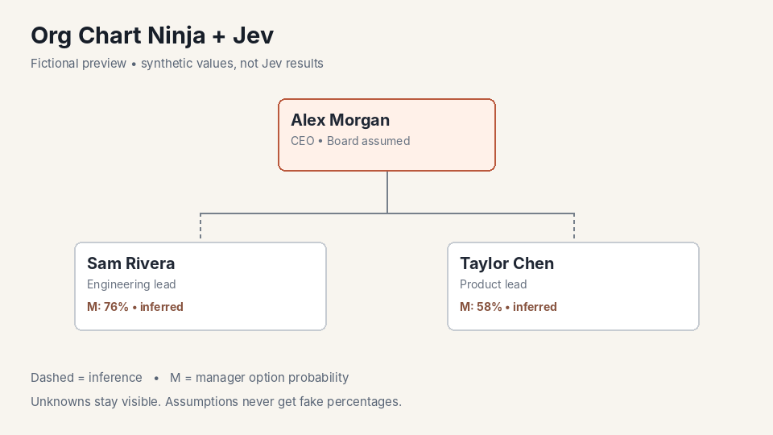

# Bot Org Chart Ninja with Jev

Link to create new bot: **Pending publication**

Turn a company name—and optionally a names/email list—into a sourced, probabilistic org chart. Research public LinkedIn profiles with Google X-Ray, use Jev to estimate departments, functions and direct managers, and explore the results through diagrams, a people summary chart and profile summaries.

## Start

Copy [PROMPT.md](PROMPT.md), share the company, optionally add its LinkedIn company URL, and attach a list if available.

Missing company? The bot helps you choose and asks permission. Missing list? No problem—choose a public-research scope; project members are an opt-in fallback only outside Playground.

## What you get

- Org overview and department diagrams—or a consented collection of separate group charts—with Jev option probabilities beside names.
- Searchable/filterable people summary chart.
- LinkedIn career and company-specific summaries, sources and uncertainty.
- CSV/JSON downloads.

These are probabilistic research results, not verified reporting lines or a complete employee directory. Jev must be provisioned on the deployment; Google access and any alternative search integration must be available. Missing dependencies are explained, never hidden.

## Large rosters

- **Up to 250 people:** one scoped org-chart explorer.
- **251–1,000:** choose a narrower city, region, country, function or department—or approve smart grouping and separate charts of up to 250 people each.
- **Over 1,000:** narrow first. Whole-list grouping is not a workaround.

Jev accepts at most 255 options per Choice question; the workflow counts uncertainty options too.

## Portable context

[Wikis/](Wikis/) bundles the Jev, diagram-design, LinkedIn research and data-contract guides. Read them as Markdown; the project does not need matching wiki pages. [fallback.md](fallback.md) defines consent and dependency rules.

## Illustrative preview

The preview uses fictional names and synthetic percentages to show the visual idea. It is not a customer example or evidence of a completed research run.

## Files

`BOT.md` is the full reusable workflow. `PROMPT.md` is the short launch prompt. `fallback.md` handles missing inputs. `Wikis/` is portable operational context. `TESTS.md` is the acceptance checklist. `assets/` contains the fictional preview.

## Publication

Publication checklist: merge this folder, verify raw Markdown access, mint the Playground seed from PROMPT.md and replace the pending link here and in the root README. Keep the folder and BOT.md paths stable once public links exist.

Diagram Design adaptation: Cathryn Lavery, MIT; reference revision and notice in the bundled guide and licenses/.
